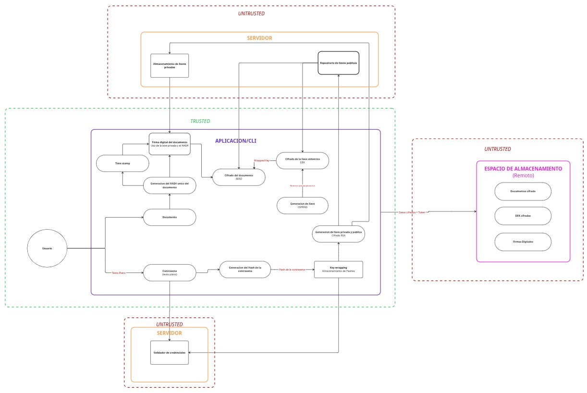

# Arquitectura y análisis de amenazas

## 1. Descripción del sistema
¿Qué problema resuelve tu bóveda?

En un mundo moderno que avanza cada día más hacia la digitalización, globalización y automatización de procesos, ha surgido la necesidad de contar con documentos personales de manera digital para su uso, incluso a veces de forma inmediata. 
En la vida real, las personas cuentan con algún espacio donde mantener los documentos especiales en un mismo lugar, séase un folder, un archivero, entre otros. La bóveda entonces funcionará análogamente a este proceso, pues será diseñada para contener cierta cantidad de archivos de manera centralizada e impedir que personas no autorizadas lean, copien, alteren o extraigan información de los documentos, con la facilidad de compartirlos de manera que no queden expuestos y contar con una trazabilidad acerca de quién crea y quién tiene acceso a los documentos.

¿Cuáles son las características principales?

Los archivos se almacenarán y mantendrán cifrados para evitar acceso sin autorización.
La bóveda incorporará mecanismos para la autenticación y verificación de usuario. 
El usuario podrá acceder a los documentos cuando los requiera.
Se protegen las llaves privadas y se gestiona su uso de forma controlada, aplicando medidas como almacenamiento seguro, cifrado y caducidad de llaves.
Se contempla un mecanismo de backup para las llaves para evitar que el usuario pierda acceso en caso de olvido de credencial o pérdida de acceso al dispositivo. Se podrá recuperar al cumplir los requisitos de verificación.
La bóveda incorporará mecanismos que permitan detectar la modificación de los archivos, verificando su integridad y autenticidad, de modo que sea posible identificar si el contenido fue alterado y confirmar quién realizó el último cambio.

¿Qué está explícitamente fuera del alcance?

El sistema se enfoca en la seguridad digital de los archivos y llaves privadas mediante mecanismos de cifrado y autentificación, como está planteado en este documento no puede proteger contra ataques de ingeniería social o descuidos del usuario con respecto a la privacidad de las credenciales con las que ingresará al sistema.
El sistema busca garantizar la seguridad computacional de los archivos almacenados ante atacantes con capacidad de cómputo acotada, no entra en el alcance del proyecto implementar algoritmos post-cuánticos o considerando capacidades de cómputo infinitas, tampoco se garantiza la seguridad física de la información en caso de algún desastre natural, accidente o ataque malicioso

## 2. Arquitectura del sistema

## 3. Requerimientos de seguridad

## 4. Modelo de amenaza

## 5. Suposiciones de confianza

## 6. Análisis de superficie de ataque

### Puntos de entrada posibles

- Credenciales de acceso

    - El uso de contraseñas débiles puede comprometer la seguridad del sistema dando acceso a posibles atacantes, el uso de un solo factor de autentificación también puede comprometer la seguridad del sistema.
    - Compromete la confidencialidad, integridad y autentificación del sistema.
- Entrada de archivos.

    - El manejo incorrecto de archivos puede llevar a que archivos maliciosos causen daños al sistema, tal como caídas del sistema, sobreescritura de información o saturación del espacio de almacenamiento.
    - Compromete la integridad y disponibilidad del sistema.

- Datos en memoria.

    - El manejo incorrecto de la información en memoria podría causar que la información en una sesión activa del programa sea leída por un malware presente en el sistema o expuesta en la memoria virtual.
    - Compromete la confidencialidad de los archivos, puede comprometer la autentificación y no repudio si se exponen llaves privadas.

- Algoritmos de cifrado

    - El uso de algoritmos de cifrado inseguros, posiblemente implementados para mantener compatibilidad con hardware viejo, pueden ser atacados por vulnerabilidades conocidas revelando secretos como el contenido de los archivos almacenados o las llaves privadas.
    - Compromete la confidencialidad e integridad de los contenidos y el no repudio al permitir el uso de llaves privadas por un usuario no autorizado.

- Repositorio de llaves públicas

    - Puede ser objetivo de ataques de sustitución de las llaves originales o las llaves pueden ser interceptadas en tránsito, el uso insuficiente o la omisión de cifrado en el almacenamiento de las llaves podría exponer el sistema a fallos de verificación de la identidad de los autores de los archivos. 
    - Compromete la autentificación de la información. 

- Verificación de firmas
    - La implementación incorrecta de la verificación de firmas o una implementación débil de esta puede llevar a que se acepten archivos provenientes de usuarios maliciosos.
    - Compromete la integridad y el no repudio de la información.

- Datos en tránsito

    - El manejo inapropiado de los datos en tránsito puede prestarse a ataques de tipo Man-in-the-Middle, se deben asegurar correctamente los datos para asegurar que aun si son capturados no se pueda comprometer la información contenida en ellos.
    - Compromete la confidencialidad y la autentificación de la información.
- Respaldo de llaves

    - El almacenamiento inadecuado del respaldo de llaves puede comprometer todo el sistema, esto puede ser por las razones mencionadas en los puntos anteriores, tal como el almacenamiento del respaldo de manera insegura o el uso de cifrado débil.
    - Compromete la confidencialidad, integridad y autentificación del sistema

## 7. Restricciones de diseño
