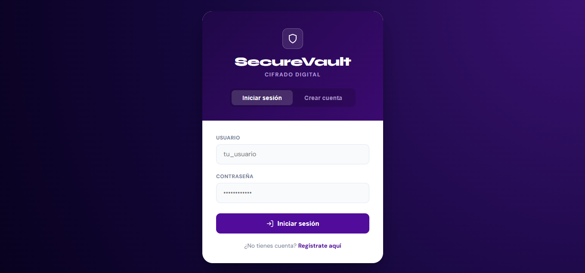

# Bóveda Digital


Proyecto para la clase de Criptografía

El objetivo principal del sistema es proteger, compartir y verificar documentos digitales mediante técnicas criptográficas modernas. Debe permitir a los usuarios cifrar archivos, compartirlos de forma segura con destinatarios seleccionados, verificar su autenticidad y gestionar sus claves criptográficas de forma responsable.

Contribuyentes:

- Castillo Soto Jacqueline,
- Meneses Calderas Grecia Irais,
- Pérez Osorio Luis Eduardo,
- Rivas Gil María Lucía.

## Arquitectura y Modelo de Amenazas ( D1 )

Primer acercamiento, descripción y planeación del sistema. Se define la arquitectura, los requerimientos de seguridad, el modelo STRIDE, las suposiciones de confianza, el análisis de superficie de ataque y las limitaciones de diseño.

El desglose de todos los puntos está disponible en:

[ArchitectureThreatModel](documentation/D1-ArchitectureAndThreatModel/ArchitectureAndThreatModel.md)

## Cifrado simétrico ( D2 )

El modulo de cifrado simétrico implementa un esquema AEAD (Authenticated Encryption with Associated Data) por medio de AES-GCM para cifrar archivos en un contenedor seguro ```\src\vault_container\```.

El reporte de este modulo está disponible en:

[SecureSymEncryptionModule](documentation/D2-SecureSymEncryptionModule/FileEncryptionModule.md)

## Cifrado híbrido ( D3 )

El modulo de cifrado híbrido implementa un mecanismo de cifrado de llave privada para el almacenamiento seguro de las llaves simétricas utilizadas por el modulo anterior, la llave simétrica es cifrada utilizando las llaves publicas de los receptores autorizados, estos receptores pueden entonces descifrar la llave simétrica utilizando su llave privada.

El reporte de este modulo está disponible en:

[Hybrid Encryption](documentation/D3%20-%20Hybrid%20Encryption/HybridEncryption.md)

## Firmas ( D5 )

Se implementó un mecanismo de firmado para el texto cifrado y los metadatos asociados, permitiendo autentificar la identidad del remitente antes de descifrar el archivo.

El reporte de este modulo está disponible en:

[Signatures and authentication](documentation/D5-SignaturesAndAuthentication/D5-SignaturesAndAuthentication.md)

## Administración de llaves ( D5 )

Para esta entrega se implemento un ciclo de vida para las llaves asimétricas utilizadas para compartir archivos, en conjunto a esto se implemento una serie de mecanismos para administrar de manera segura la generación y almacenamiento de las llaves privadas en un contenedor seguro mediante el uso de una función de derivación de llave (KDF).

El reporte de este modulo está disponible en:

[Key Management](documentation/D6-KeyManagement/D6-KeyManagement.md)

# Uso del programa

Los comandos se ejecutan desde el directorio raíz del proyecto. 

Existen dos formas de ejecutar el proyecto:
- En [terminal](#terminal),
- En [interfaz gráfica](#GUI).

El sistema no está listo para producción.

## GUI

Para ejecutar la interfaz se debe crear un entorno virtual en el directorio raíz del proyecto.

``python -m venv /path/envName``

El entorno virtual se debe activar. Se recomienda consultar la [documentacion oficial](https://docs.python.org/3/library/venv.html) de python en la sección **'How venvs work'** para ejecutar el comando correcto de acuerdo al sistema operativo del usuario.

Para lanzar el servidor de desarrollo, ejecutar:

``python -m src.front.app``

Al dirigirnos al host que Flask asigna a la aplicación, nos muestra la pantalla de inicio de sesión.



Para terminar la ejecución se presiona ``CTRL+C`` y para desactivar el entorno virtual se digita el comando:

``deactivate``

## Terminal

### Creación de usuarios

``python -m src.main create-user <usuario>``

En este punto del desarrollo no se ha implementado un mecanismo para transmitir llaves, todos los usuarios deben ser creados localmente.

### Cifrado de archivos

``python -m src.main encrypt <ruta del archivo a cifrar> --sender <Usuario del remitente> --to <Lista de usuarios>``

La lista de usuarios es una serie de nombres de usuario separada por espacios.

### Descifrado de archivos

``python -m src.main decrypt --user <nombre> <ruta origen> <ruta objetivo>``

Ruta objetivo es el archivo a descifrar, ejemplo ``"\vault_container\test.txt"``

Ruta destino es la ruta donde se creara el archivo descifrado

### Administración de laves

- Rotación de llaves

    Genera un nuevo par de llaves RSA, automáticamente respalda la llave anterior a la bóveda del usuario.
    ``python -m src.main rotate-key --user <usuario>``

- Revocación de llaves

    Marca una llave como revocada evitando que sea usada por el sistema.
    ``python -m src.main revoke-key --user <usuario>``

- Respaldo de llaves

    Copia las llaves de un usuario a un directorio objetivo.
    ``python -m src.main backup-user --user <usuario> --output <ruta objetivo>``

- Restaurar llaves

    Restaura una copia de las llaves de un usuario desde un respaldo previo.
    ``python -m src.main backup-user --user <usuario> --input <ruta origen>``
